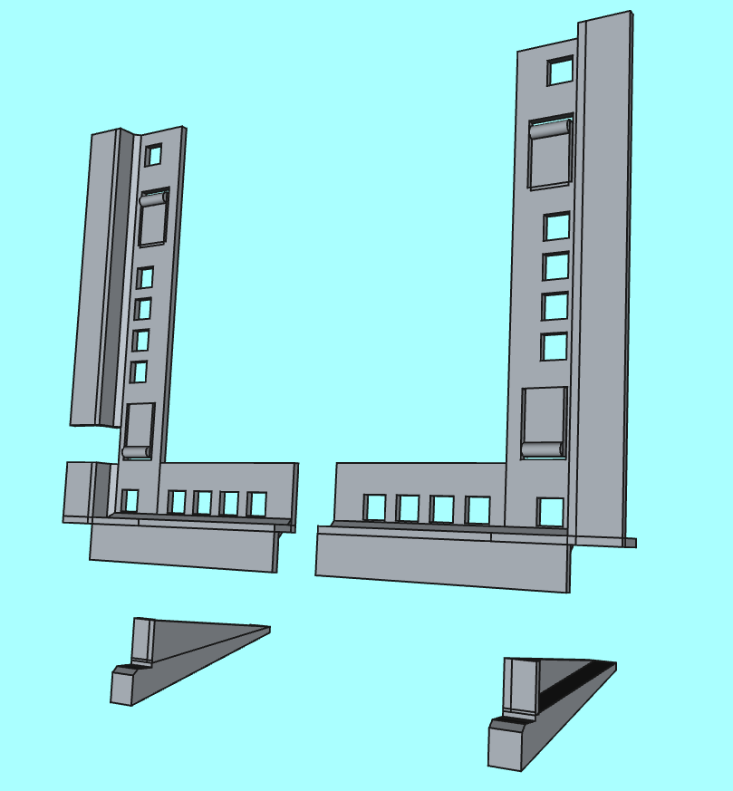
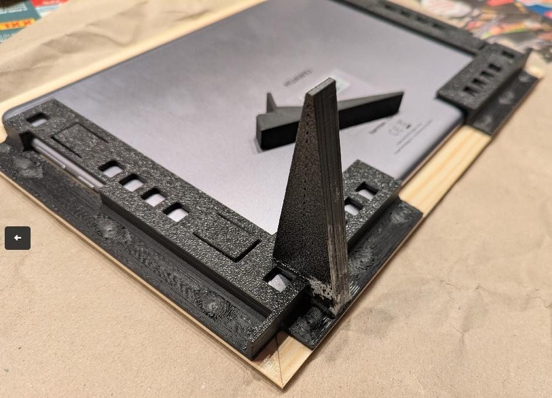

# Workflow zur programmatischen Erzeugung von 3D-Modellen mit FreeCAD

## Grundkonzept

Die Modelle werden in einer Python-Datei in einer Methode `create_geometry` erzeugt. Diese liefert ein oder mehrere FreeCAD-Objekte zurück. Ein Modell kann entweder in der FreeCAD Gui gerendert und interaktiv angeschaut/bearbeitet werden oder via CLI Headless zum Beispiel nach STL konvertiert werden.

## FreeCAD Gui

Die FreeCAD Gui wird zum Live-Preview der Modelle verwendet. Ein Makro `LiveGeometryReloader.FCMacro.py` lädt eine auswählbare Modell-Datei, überwacht diese auf Änderungen und lädt sie dann neu.

## FreeCAD CLI

Der Wrapper 'freecad_headless.py' verwendet die FreCAD-Python-CLI. Er ermöglicht es, eine Modell zu prüfen und als STL oder 3MF zu exportieren

## Slicer

Das exportierte 3MF Modell kann direkt als Projekt im Anycubic Slicer Next geöffnet werden. Dort können Slicer-Einstellungen manuell gemacht werden.

TODOs:
- Es wäre super, wenn in einem bestehenden Slicer-Projekt die Modelle ersetzt werden können, ohne das Slicing erneut manuell durchzuführen
- Die Bezeichnung der Objekte geht bem Export nach 3MF verloren -> Ticket bei FreeCAD aufmachen, dass die Metadaten exportiert werden können

# Projekte

## Matrix-LED-Diffuser

Ein Diffuser für LED-Matrix PCBs mit adressierbaren RGB-LEDS.

* Geometrie-Datei: `geometry_led_diffuser.py`
* Features
    * Größe der Matrix und Anzahl LEDs einstellbar
    * optionale Aussparungen für Widerstände (horizontal/vertikal)
    * optionaler äußerer Rand
* Slicer-Settings
    * Beim Import: "Als ein kombiniertes Objekt importieren"
    * Objekt "Object_1" -> Farbe Weiß wählen; Rest: schwarz
    * Prozess 0.16mm Standard @AC KS1
        * Allgemein -> Qualität -> Anzahl der langsamen Schichten: 2 (dadurch werden die 2 Diffusor-Schichten sauberer gedruckt)
        * Objekte -> Object_1 (Diffusor-Schicht) -> Qualität -> Wände und Oberflächen
            * Flussrate 1,13
        * Multimaterial: Reinigungsturm deaktivieren
    * Schraubenlöcher aktiv? -> Stützstruktur aktivieren
* Ideen
    * mehrere LED-Matrix-PCBs in einem Rahmen horizontal und/oder vertikal
    * mehrere Rahmen zusammensteckbar
    * Clip für LED-Matrix-PCB
    * Befestigungs-Ösen
    * Aussparungen für Kabel

## Fidget Pyramid (Work-in-Progress)

* Slicer Settings
    * Beim Import: "Als ein kombiniertes Objekt importieren"
    * Prozess 0.16mm Standard @AC KS1
    * Wenn der "Griff" an ist, müssen dafür Stützstrukturen aktiviert werden (mit Default-Werten)

## Tablet Holder

Ein parametrischer Halter für Tablets als digitaler Bilderrahmen. Der Halter wird hinten auf einen passenden Holzrahmen geklebt und hält das Tablet mit Clips zum Einrasten.

* Geometrie-Datei: `geometry_tablet_holder.py`
* Features
    * Parametrisch für verschiedene Tablet-Größen anpassbar
    * Zwei gespiegelte Halter (links/rechts) mit separaten Cutouts für Anschlüsse
    * Separate Balken-Teile zum extra Drucken und Ankleben (bessere Druckqualität)
    * Clips mit Halbzylinder-Nubs zum Einrasten des Tablets
    * Diagonale Verstrebung zwischen Rückwand und Balken
    * Gussets für zusätzliche Stabilität
    * Konfigurierbare Cutouts in den Seitenwänden (für Kabel/Buttons)
* Parameter (Default für Huawei MediaPad M5 Lite 10)
    * `TABLET_THICKNESS`: Dicke des Tablets (9.0mm)
    * `HOLDER_WIDTH`: Breite des Halters (23.0mm)
    * `HOLDER_HEIGHT`: Höhe des Halters (150.0mm)
    * `BEAM_TILT_ANGLE`: Neigungswinkel des Balkens (15°)
    * `CUTOUT_*`: Position und Größe der Cutouts für Anschlüsse
* Slicer-Settings
    * Prozess 0.20mm Standard
    * Die Halterungen werden mit dem aufzuklebenden Flansch nach oben gedruckt. Stützstrukturen müssen aktiviert werden
    * Die beiden Ständer-Teile werdenliegend ohne Stützen gedruckt
    * Infill 0%, dafür 100 Wandschleifen (massiver Druck als "Wände" für bessere Stabilität)

